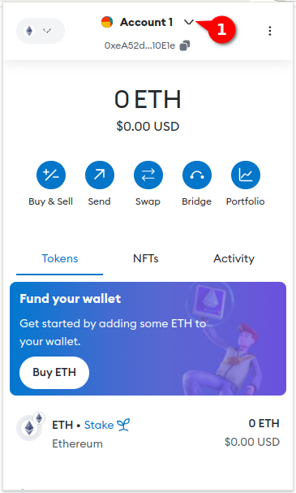
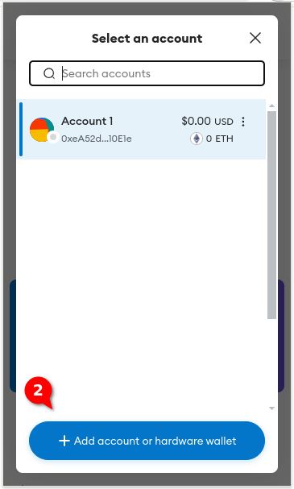
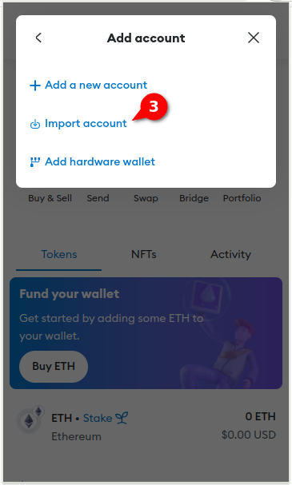
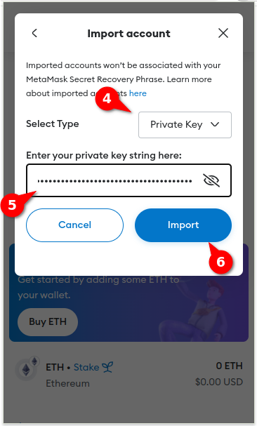

# Manually recover funds

These instructions will help you recover the funds from your master wallet and service related accounts.

You need to install [Metamask](https://metamask.io/) in your browser.

## Recover wallet info

Run the script `./recover_wallet_info.sh`. You will need to provide your local account password. The output of the script will be something similar to

```text
------------------------------
Master Wallet and Master Safes
------------------------------
Master Wallet (EOA):
  * Address: 0x0000000000000000000000000000000000000000
  * Private key: 0x0000000000000000000000000000000000000000000000000000000000000000

Master Safe(s):
  * Safe BASE: https://app.safe.global/home?safe=base:0x0000000000000000000000000000000000000000

--------
Services
--------
  * Service dvilela/memeooorr:
    - Service Agent(s):
      - Agent 1 address (EOA): 0x0000000000000000000000000000000000000000
        Agent 1 private key: 0x0000000000000000000000000000000000000000000000000000000000000000

    - Service Safe(s):
      - Safe BASE: https://app.safe.global/home?safe=base:0x0000000000000000000000000000000000000000
        Olas Registry BASE: https://registry.olas.network/base/services/<ID>     
```

Answer `yes` When prompted:

```text
Do you want to terminate ALL the services? (yes/no): y
```

**Notes:**

- The actual output of the script will deppend on the number of services you have and the chains these services are in.
- The displayed URLs will be useful to follow the steps below.
- If your service is registered in multiple chains, the script will terminate and unbond in all the chains.
- Staking contracts have a minimum staking time. You cannot terminate your service until the minimum staking time has passed since you last staked your service (typically 72 hours).

## Step 1: Ensure your services are terminated and unbonded

1. On a web browser, open the Olas Registry Webapp page of your service: https://registry.olas.network/CHAIN/services/SERVICE_ID.
2. If your service is terminated and unbonded, you should see that its state is "Pre-Registration".

You need to check for all the chains your service is in.

**Only proceed with the steps below if your service is terminated and unbonded. A service which is staked for less than the minimum staking time cannot be unbonded yet.**

## Step 2: Import EOA wallets to Metamask

Import the addresses corresponding to

- the Master Wallet EOA,
- the service Agent(s) EOA (of each service).

For each of these addresses, follow these steps in Metamask:

1. Press the "Select account" dropdown menu.
2. Press the button "+ Add account or hardware wallet".
3. Click on "Import account".
4. Make sure "Select type" is "Private Key". Next, paste the corresponding private key and press "Import".






## Step 3: Drain your service Safe and Agent(s) EOA

1. On a web browser, open the Safe webapp interface https://app.safe.global/home?safe=CHAIN:SERVICE_SAFE for your Service Safe, and connect using your Agent(s) EOA through Metamask.
2. Transfer all your assets from the Service Safe to an address you own using the "Send" button.
3. Once the Safe is drained, you can transfer your Agent(s) EOA assets through Metamask to an addres you own.

**Warning:** Do not drain the Agent(s) EOA before draining the Service Safe!

## Step 4: Drain your Master Safe and Master Wallet EOA.

Similarly as you did in [Step 3](#drain-your-service-safe-and-agents-eoa), you must drain your Master Safe and then your Master Wallet EOA.
